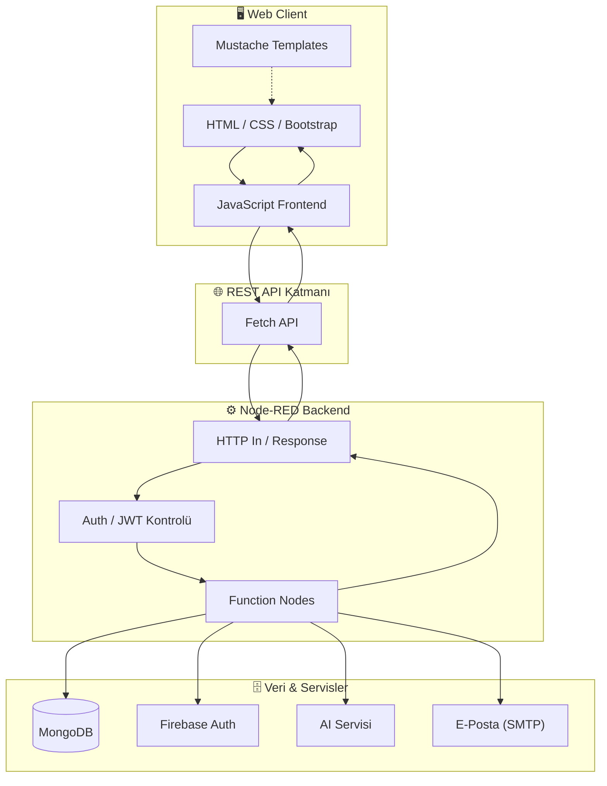
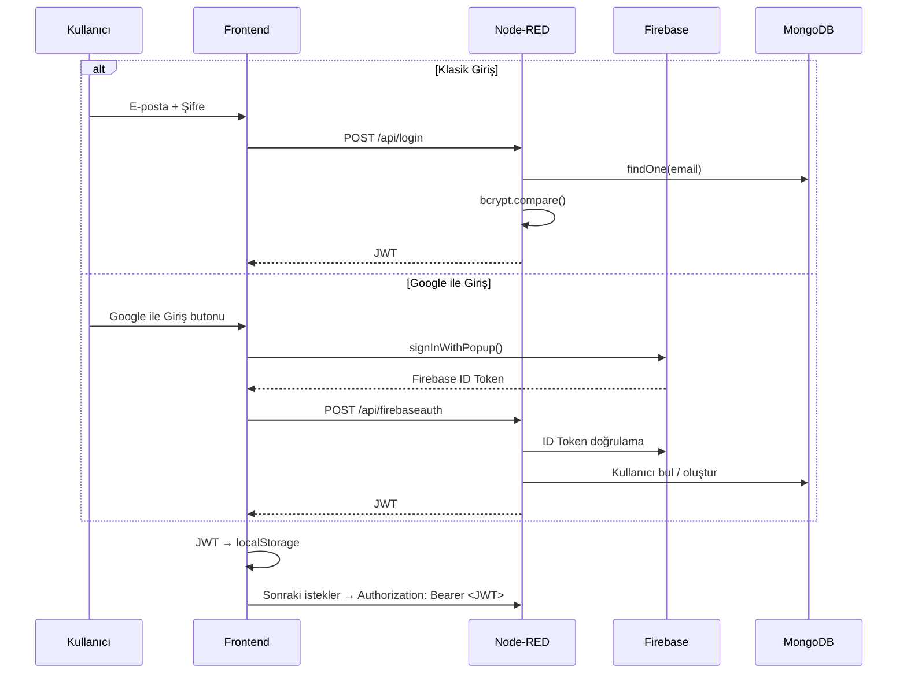

<div align="center">

# 🚀 TaskFlow

**Node-RED tabanlı, API odaklı modern görev & proje yönetim platformu**

[](https://nodered.org/)
[](https://www.mongodb.com/)
[](https://firebase.google.com/)
[](https://jwt.io/)
[](#-lisans)

*Planla. Organize et. Takip et. Analiz et.*

</div>

---

## 📌 İçindekiler

- [Proje Hakkında](#-proje-hakkında)
- [Öne Çıkan Özellikler](#-öne-çıkan-özellikler)
- [Sistem Mimarisi](#-sistem-mimarisi)
- [Teknoloji Yığını](#-teknoloji-yığını)
- [Proje Dosya Yapısı](#-proje-dosya-yapısı)
- [Kimlik Doğrulama Akışı](#-kimlik-doğrulama-akışı)
- [REST API Referansı](#-rest-api-referansı)
- [Kurulum](#-kurulum)
- [Environment Değişkenleri](#-environment-değişkenleri)
- [Çalıştırma](#-çalıştırma)
- [⚠️ Güvenlik — Önce Bunu Okuyun](#️-güvenlik--önce-bunu-okuyun)
- [Üretime Alma Kontrol Listesi](#-üretime-alma-kontrol-listesi)
- [Yol Haritası](#-yol-haritası)
- [Katkıda Bulunma](#-katkıda-bulunma)
- [Lisans](#-lisans)

---

## 🧠 Proje Hakkında

**TaskFlow**, bireysel kullanıcıların görevlerini, projelerini, takvimlerini ve çalışma süreçlerini tek bir arayüz üzerinden yönetmesini sağlayan; **Node-RED** tabanlı bir backend, **vanilla JavaScript** ile yazılmış bir frontend, **MongoDB** veri katmanı ve **Firebase / Google Authentication** üzerine kurulu bir görev yönetim uygulamasıdır.

Klasik bir "yapılacaklar listesi"nden farklı olarak TaskFlow; kullanıcı yönetimi, görev ve proje CRUD işlemleri, takvim, analiz/istatistik ekranları, bildirim sistemi, çok dilli arayüz ve yapay zekâ destekli öneriler gibi modülleri tek bir mimari altında birleştirir. Frontend ile backend katmanları REST API üzerinden haberleşecek şekilde bilinçli olarak birbirinden ayrılmıştır.

---

## ✨ Öne Çıkan Özellikler

| Modül | Açıklama |
|---|---|
| 🔐 **Kullanıcı Yönetimi** | Kayıt, giriş, çıkış, JWT tabanlı oturum, Google ile giriş, Firebase Authentication, şifre sıfırlama |
| 📋 **Görev Yönetimi** | Oluşturma, düzenleme, silme, durum/öncelik/son tarih atama, filtreleme, projeye bağlama |
| 📁 **Proje Yönetimi** | Görevleri proje bazında gruplama, proje durum takibi |
| 📅 **Takvim** | FullCalendar entegrasyonu ile tarih bazlı görev görünümü |
| 📊 **Analiz & İstatistik** | Tamamlanma oranları, öncelik dağılımı, proje performansı |
| 🤖 **AI Destekli İçerik** | Dashboard'da AI servisi üzerinden üretilen dinamik öneriler (API anahtarı yalnızca backend'de) |
| 🔔 **Bildirimler** | Toast tabanlı anlık geri bildirim sistemi |
| 🌍 **Çoklu Dil** | `data-i18n` etiketleri ve JSON dil dosyaları ile TR/EN/DE/ES/FR desteği |
| 🧩 **Mustache Templates** | Tekrar kullanılabilir UI bileşenleri için sunucu/istemci taraflı şablonlama |
| 📊 **DataTables** | Sıralama, arama ve sayfalama destekli veri tabloları |

---

## 🏗️ Sistem Mimarisi



**Katmanlar:**

1. **Presentation Layer** — HTML, CSS, Bootstrap, jQuery, Font Awesome, SurveyJS, FullCalendar, DataTables
2. **Application Layer** — `fetch()` tabanlı REST çağrıları (`www/js/api.js`, `common.js`)
3. **Backend Layer** — Node-RED flow'ları (`flows.json`): HTTP In → Function → MongoDB → HTTP Response
4. **Data Layer** — MongoDB koleksiyonları (`users`, `tasks`, `projects`, `notifications`)

---

## 🧰 Teknoloji Yığını

<table>
<tr><td valign="top">

**Frontend**
- HTML5 / CSS3 / JavaScript (ES6+)
- Bootstrap 5
- jQuery
- Mustache.js
- SurveyJS
- FullCalendar
- DataTables
- Font Awesome

</td><td valign="top">

**Backend**
- Node.js
- Node-RED (flow tabanlı akış motoru)
- REST API (HTTP In / Response node'ları)
- bcrypt (parola hashleme)
- jsonwebtoken (JWT)

</td><td valign="top">

**Veri & Servisler**
- MongoDB / Mongoose
- Firebase Admin SDK
- Google Auth Library
- Harici AI servisi (Groq)
- SMTP e-posta bildirimi

</td></tr>
</table>

---

## 📂 Proje Dosya Yapısı

```
TaskFlow/
│
├── www/                        # Statik frontend
│   ├── css/                    # Sayfa bazlı stiller (login, dashboard, tasks, ...)
│   ├── js/                     # Modüler frontend mantığı
│   │   ├── api.js              # fetch tabanlı HTTP yardımcıları
│   │   ├── common.js           # Ortak yardımcı fonksiyonlar, bildirimler
│   │   ├── index.js            # Sayfa yönlendirme (router)
│   │   ├── dashboard.js / tasks.js / projects.js / calendar.js / analytics.js / settings.js / profile.js
│   │   └── firebaseGoogle.js   # Google ile giriş entegrasyonu
│   ├── templates/*.mustache    # Yeniden kullanılabilir kart şablonları
│   ├── lang/*.json             # Çoklu dil kaynakları (tr, en, de, es, fr)
│   ├── images/                 # Statik görseller
│   └── data/                   # Örnek/geliştirme verisi
│
├── flows.json                  # Node-RED backend akışları (API mantığı burada)
├── settings.js                 # Node-RED çalışma zamanı ayarları
├── index.html                  # Uygulama giriş noktası
├── package.json / package-lock.json
├── .env.example                 # Ortam değişkeni şablonu (gerçek değerler değil!)
├── .gitignore
└── README.md
```

> 💡 Yeni bir modül eklerken ilgili `js`, `css` ve (varsa) `mustache` dosyasını ayrı tutmak, projenin modüler yapısını korur.

---

## 🔐 Kimlik Doğrulama Akışı



Uygulama içi tüm korumalı isteklerde `Authorization: Bearer <token>` başlığı beklenir; JWT doğrulaması Node-RED tarafında ilgili `HTTP In` node'una bağlı bir kontrol fonksiyonunda yapılmalıdır (bkz. [Güvenlik](#️-güvenlik--önce-bunu-okuyun)).

---

## 🌐 REST API Referansı

| Yöntem | Endpoint | Açıklama | Yetki |
|---|---|---|---|
| `POST` | `/api/register` | Yeni kullanıcı kaydı | Açık |
| `POST` | `/api/login` | E-posta/şifre ile giriş | Açık |
| `POST` | `/api/firebaseauth` | Google/Firebase ile giriş | Açık |
| `POST` | `/api/resetpassword` | Şifre sıfırlama e-postası gönderimi | Açık |
| `POST` | `/api/newpassword` | Token ile yeni şifre belirleme | Token ile |
| `GET` | `/api/tasks` | Görevleri listele | 🔒 JWT |
| `POST` | `/api/tasks` | Görev oluştur | 🔒 JWT |
| `PUT` | `/api/tasks/:id` | Görev güncelle | 🔒 JWT |
| `DELETE` | `/api/tasks/:id` | Görev sil | 🔒 JWT |
| `GET` | `/api/projects` | Projeleri listele | 🔒 JWT |
| `POST` | `/api/projects` | Proje oluştur | 🔒 JWT |
| `GET` | `/api/notifications` | Bildirimleri listele | 🔒 JWT |

> Tüm `🔒 JWT` işaretli uçlar, kullanıcı kimliğini **query/body parametresinden değil**, doğrulanmış JWT içeriğinden almalıdır (aşağıdaki güvenlik notuna bakın).

---

## ⚙️ Kurulum

```bash
# 1. Depoyu klonlayın
git clone https://github.com/R-Tunahan-Kayahan/ToDoListApplication.git
cd ToDoListApplication

# 2. Bağımlılıkları kurun
npm install

# 3. Ortam dosyasını oluşturun
cp .env.example .env
# .env içindeki değerleri kendi ortamınıza göre doldurun

# 4. Node-RED'i başlatın
npx node-red
```

Node-RED editörüne varsayılan olarak `http://127.0.0.1:1880` adresinden, uygulamanın kendisine ise yapılandırdığınız statik dosya sunucusu/portu üzerinden erişilir.

---

## 🔑 Environment Değişkenleri

`.env.example` şablonunu temel alarak `.env` dosyanızı oluşturun:

```env
# Uygulama oturumu
JWT_SECRET=

# Node-RED editör/credential şifreleme anahtarı
NODE_RED_CREDENTIAL_SECRET=

# MongoDB bağlantı adresi
MONGODB_URI=

# Firebase
FIREBASE_API_KEY=
# firebase-service-account.json içeriği ayrı ve repo dışı tutulmalıdır

# AI servisi
GROQ_API_KEY=

# SMTP (şifre sıfırlama e-postaları)
SMTP_HOST=
SMTP_USER=
SMTP_PASS=
```

Node-RED Function node'ları içerisinde bu değerlere `env.get("JWT_SECRET")` gibi çağrılarla erişilir. **Gerçek değerler asla `flows.json` içine gömülmemeli**, yalnızca `env.get(...)` referansı bırakılmalıdır.

---

## ▶️ Çalıştırma

| Ortam | Komut |
|---|---|
| Geliştirme | `npx node-red` |
| Prod (örnek, pm2 ile) | `pm2 start node-red -- -u . ` |
| Build gerekmez | Frontend statik dosyalardan oluşur (`www/`) |

---

## ⚠️ Güvenlik — Önce Bunu Okuyun

Depo/proje incelemesinde acil müdahale gerektiren birkaç nokta tespit edildi. Bunları README'nin en görünür yerine bilerek koyuyorum:

1. **Sızmış kimlik bilgileri:** `firebase-service-account.json`, `flows_cred.json`, `.config.users.json` gibi dosyalar depo içinde bulundu ve `.gitignore` bu proje kökünde mevcut değildi. Bu dosyalar bir yere push edildiyse:
   - Firebase servis hesabı anahtarını **Firebase Console → Proje Ayarları → Servis Hesapları** üzerinden derhal iptal edip yeni anahtar üretin.
   - `NODE_RED_CREDENTIAL_SECRET` ve `JWT_SECRET` değerlerini değiştirin (mevcut tüm oturumlar geçersiz olur, bu istenen bir şey).
   - Git geçmişinden bu dosyaları `git filter-repo` / BFG ile temizleyin.
2. **`.gitignore` eksikliği:** Aşağıdaki satırları projeye ekleyin:
   ```gitignore
   .env
   .env.*
   firebase-service-account.json
   service-account.json
   flows_cred.json
   .config.nodes.json*
   .config.runtime.json*
   .config.users.json*
   node_modules/
   *.backup
   *.bak
   *.log
   .vscode/
   ```
3. **Yetkilendirme (IDOR) riski:** İncelenen `flows.json` içindeki bazı fonksiyon node'ları (`Bul`, `Proje Bul`, `find`) kullanıcı kimliğini doğrudan `msg.req.query.userId` üzerinden alıyor. Bu, JWT doğrulanmadan **herhangi bir `userId` parametresiyle başka kullanıcıların görev/proje/bildirim verisine erişilebileceği** anlamına gelir. Düzeltme: `userId` her zaman doğrulanmış JWT'nin `payload.id` alanından okunmalı, istemciden gelen `userId` parametresi asla güvenilir kabul edilmemelidir.
4. **Şifre sıfırlama token'ı:** Sıfırlama bağlantısı e-postada düz metin token içeriyor; token'a bir **son kullanma tarihi (`expiresAt`)** eklenip `TokenBul` adımında bu tarihin kontrol edilmesi önerilir.
5. Production için ayrıca: HTTPS zorunlu kılınmalı, CORS politikası daraltılmalı, `node.warn`/`node.error` ile hassas veriler (token, şifre) loglanmamalı.

---

## ✅ Üretime Alma Kontrol Listesi

- [ ] Gerçek secret değerleri repoda yok
- [ ] `.env` dosyası repo dışında
- [ ] Firebase servis hesabı anahtarı korunuyor / rotasyona alındı
- [ ] JWT secret güçlü ve rotasyona alındı
- [ ] AI API anahtarı yalnızca backend'de
- [ ] `userId` her zaman JWT'den okunuyor (query'den değil)
- [ ] Şifre sıfırlama token'ı süre sınırlı
- [ ] Debug logları production'da kapalı
- [ ] HTTPS aktif
- [ ] CORS politikası daraltılmış
- [ ] Tüm `/api/*` uçlarında authentication kontrolü var

---

## 🔮 Yol Haritası

- [ ] Takım/ekip yönetimi ve rol bazlı erişim (RBAC)
- [ ] Proje üyelik ve görev atama sistemi
- [ ] WebSocket ile gerçek zamanlı bildirimler
- [ ] Gelişmiş AI destekli görev/proje planlama
- [ ] Dosya ekleri, görev yorumları, activity log
- [ ] PDF / Excel export
- [ ] Docker + CI/CD
- [ ] Otomatik test altyapısı ve API dokümantasyonu (OpenAPI)
- [ ] Rate limiting

---

## 🤝 Katkıda Bulunma

1. Depoyu fork'layın
2. Özellik dalı oluşturun: `git checkout -b feature/harika-ozellik`
3. Değişikliklerinizi commit'leyin: `git commit -m "feat: harika özellik eklendi"`
4. Dalınızı push'layın: `git push origin feature/harika-ozellik`
5. Pull Request açın

---

## 📄 Lisans

Bu proje **ISC** lisansı ile lisanslanmıştır.

---

<div align="center">

**TaskFlow** — Planla. Organize et. Takip et. Analiz et.

</div>
